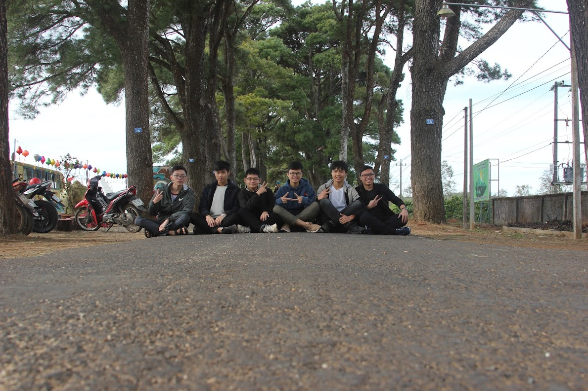
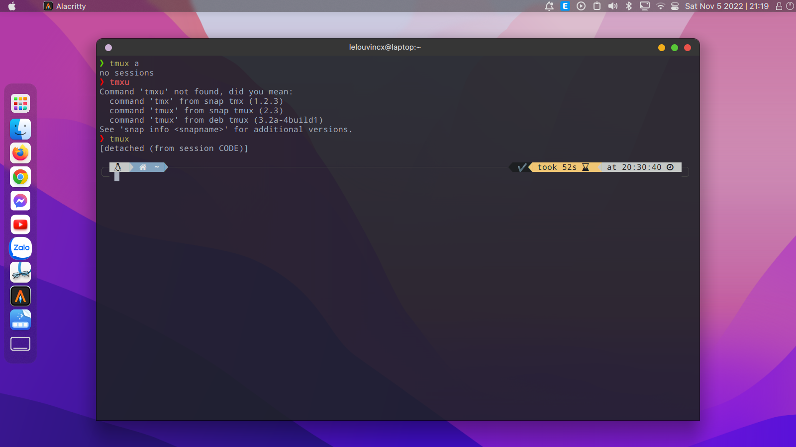
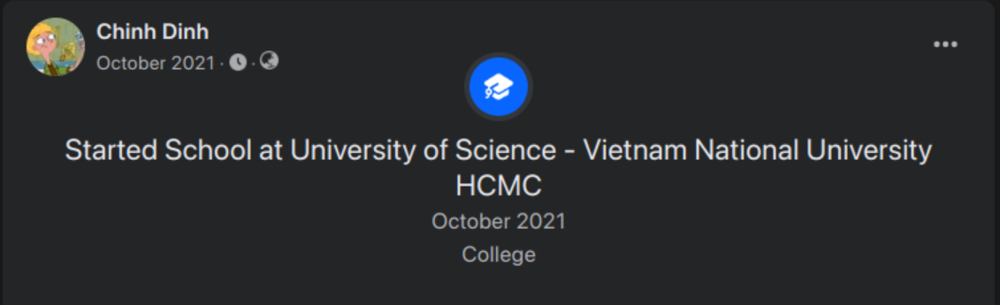

Xin chào, hello, hola!

Bài post này không nói về công nghệ cao siêu, mà nói về bản thân mình, về hành trình mình khám phá thế giới công nghệ. Mình có thói quen viết "Year of Coding" vào mỗi 2 tuần, từ 2022, tới nay cũng gần được 2 năm. Vì vậy mình nảy ra ý tưởng, mỗi năm sẽ đăng 1 lần lên blog này, coi như phần thưởng khích lệ bản thân sau một năm cố gắng.

Là bài đầu tiên nên mình gộp chặng đường từ 2018 luôn nha.

## 2018

5 năm trước, 2018, mình vào lớp chuyên toán trường chuyên Hùng Vương, Gia Lai. Thằng nhóc mà suốt những năm cấp hai ăn ngủ để làm toán, chập chững bước những bước chân đầu tiên vào thế giới tech bằng việc... config VSCode.

## 2019

Mình tham gia đội tuyển tin học quốc gia của trường. Hằng ngày thay vì cắp sách, mình cắp laptop tới trường. Mình học xoay quanh competitive programming, code C++, ngồi giải thuật toán...

## 2020

Sau bao nhiêu thời gian, công sức, và tiền bạc bố mẹ cho đi học, mình rớt đội tuyển 2 lần. Thi 2 năm, rớt 2 năm. Cảm giác rất buồn, mình từng ăn, ngủ với code, bài trên lớp không làm, học trên lớp không học. Đã có lúc mình nghĩ nên bỏ cuộc, nghĩ mình không hợp với cái này.

Thứ giữ mình lại lúc đó, chính là việc ngồi config terminal trên linux rất vui.

## 2021

Mình chọn học khoa học dữ liệu thay vì công nghệ thông tin. Lúc đầu cũng không thích lắm vì hồi đấy khoa học dữ liệu chưa nổi như bây giờ, chưa tìm hiểu gì nên chưa thấy nó hay. Rồi đấy mình mới biết ngành này thật sự có tiềm năng. Và rồi dù có đủ điểm đại học để vào CNTT, mình vẫn chọn KHDL.

Welcome mình vào đại học!

...

## 2022

### 7/6/2022

**Khám phá security**

PicoCTF, CTFlearn, Try Hack Me, ...

Đạt top 69 tại WhiteHatCTF (trong kỳ quân sự), hứng thú với cybersecurity especially crypto, forensics, OSINT.

### 1/7/2022

**Tham gia Build On Vietnam 2022**

Học AWS Fundamentals:

### 8/8/2022

**Học cách làm 1 website (blog) và luyện tập ICPC**

Config neovim mới nha =))

### 22/8/2022

**Tiếp tục luyện tập competitive programming và học javascript**

Problems on USACO:

Javascript:

### 7/9/2022

**Tiếp tục luyện tập competitive programming để thi ICPC 2022**

### 23/9/2022

**Neovim config mới: lunarvim và học Google Cloud Skillboost**

Đẹp ghê:

GCP:

### 8/10/2022

**Hoàn thành Google Cloud Skillboost**

**Planning cho hành trình mới với data science**

Tìm được blog này hay quá (của anh Hồng)
