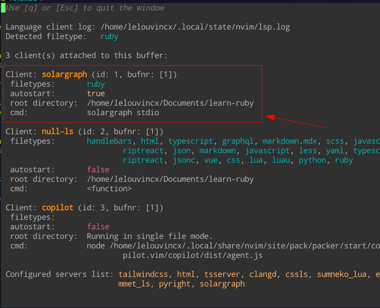

## 1. Tại sao nên đọc bài này?

Với những ai yêu thích Neovim và sử dụng nó làm IDE chính, bạn sẽ đôi lúc gặp vấn đề khó chịu khi code Ruby trên Neovim như thiếu suggestion, lint, format, ...
Nhân dịp năm mới 2023, mình sẽ hướng dẫn các bạn cách setup môi trường phát triển Ruby bằng Neovim sử dụng LSP Solargraph.

**Solargraph** là một language server cung cấp IntelliSense, code completion và docs cho Ruby.
Nó hỗ trợ nhiều IDE và text editor như VSCode, Emacs, Atom, etc và dĩ nhiên, Neovim.
[Trang chủ](https://solargraph.org/) của solargraph.

## 2. Yêu cầu

Để setup bạn cần config trước những thứ sau:

- [Ruby](https://www.ruby-lang.org/en/) cài và chạy được
- [Neovim](https://www.ruby-lang.org/en/) version 0.5.0, đã cài mason và config LSP

## 3. Cài đặt

Đầu tiên bạn cần cài gem solargraph:

```bash
gem install solargraph
```

Kiểm tra solargraph đã được cài chưa:

```bash
gem list | grep solargraph
# Nếu chưa thì dùng command sau
gem install --user-install solargraph
```

Hoặc thêm dòng sau vào Gemfile:

```ruby
gem 'solargraph', group: :development
```

Tiếp theo vào Neovim và mở mason: `:Mason`, tìm và cài 2 gói sau: `solargraph` và `rubocop`.

Nếu có config LSP theo dotfiles của mình, bạn chỉ cần thêm đoạn sau vào ~/config/nvim/lua/$USER/plugins/lsp/lspconfig.lua:

```lua
-- ...
-- configure ruby language server
lspconfig["solargraph"].setup({
 capabilities = capabilities,
 on_attach = on_attach,
 filetypes = { "ruby" },
})
-- ...
```

Xong! Bây giờ chỉ cần mở file Ruby và check `:LspInfo`, lúc này sẽ hiện 1 client có tên solargraph được attach vào buffer `.rb`:


