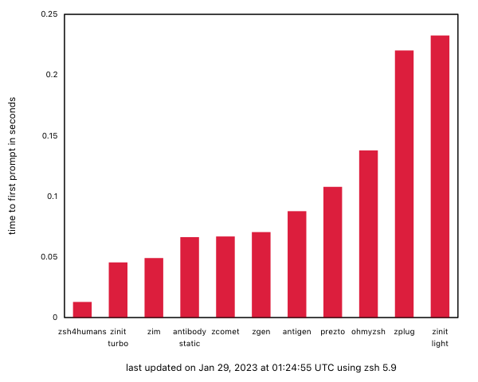
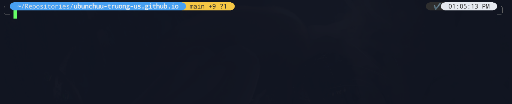
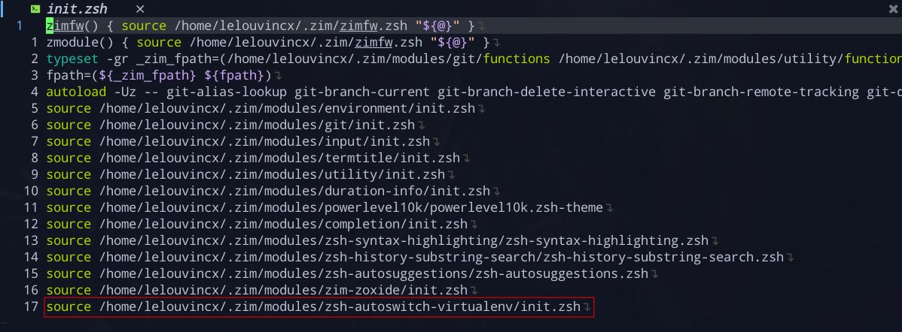

## 1. Tại sao nên đọc bài này?

Chuyện là mình vừa đọc được một bài rất tâm huyết về các zsh frameworks trên [Reddit](https://www.reddit.com/r/linuxadmin/comments/rhg7wx/zsh_frameworks/), trong đó có đoạn viết như này:

> They took the best ideas, and wrote them as brand new modules with even higher-quality code, and ended up becoming by far the fastest "full-featured zsh framework" with the [fastest startup time](https://github.com/zimfw/zimfw/wiki/Speed), most efficient Git status prompt updates, etc.
> Its clean code organization ideas were inspired by Prezto, and some of the modules (such as the git module) were taken from Prezto and cleaned up and refactored to be faster and better.
> Most modules were written from scratch.
> The entire project is very minimalistic with super clean, tiny code modules, and it's well-organized within the "ZimFW" organization on GitHub.

_Tạm dịch_: Họ chắt lọc những ý tưởng tốt nhất, viết lại những modules hoàn toàn mới với code chất lượng cao, tạo thành một zsh framework đầy đủ tính năng, với thời gian khởi động [nhanh nhất](https://github.com/zimfw/zimfw/wiki/Speed), nhiều updates hiệu quả nhất, etc.
Cấu trúc code sạch đẹp được truyền cảm hứng bởi Prezto, và một vài modules (ví dụ như git module) lấy từ Prezto được clean và refactor.
Hầu hết modules được viết lại từ đầu.
Toàn bộ project đều tối giản với modules siêu sạch, gọn, nằm trong "ZimFW" organization trên GitHub. (...)



Wow, cũng đáng để thử đấy chứ!
Cộng thêm việc mình đã quá ngán với con zsh của mình khi lúc nào bật lên cũng tốn ~0.5 - 1 giây (quá chậm cho 1 shell), vậy là quá đủ lý do để từ bỏ oh-my-zsh.
Và thế là công cuộc chuyển nhà từ oh-my-zsh của mình sang Zim bắt đầu.

## 2. Cài đặt

Đầu tiên bạn cần gỡ bỏ oh-my-zsh trước:

```bash
source ~/.oh-my-zsh/tools/uninstall.sh
```

Sau đấy khởi động lại terminal, zsh sẽ trống trơn. Tiếp theo, cài Zim bằng `curl`:

```bash
curl -fsSL https://raw.githubusercontent.com/zimfw/install/master/install.zsh | zsh
```

Hoặc bằng `wget`:

```bash
wget -nv -O - https://raw.githubusercontent.com/zimfw/install/master/install.zsh | zsh
```

Nếu không thành công, hãy thử cài thủ công ở [link này](https://zimfw.sh/docs/install/).
Khởi động lại terminal và kiểm tra Zim đã được cài thành công chưa:

```bash
zimfw
```

### Zim themes

Theme mặc định của Zim là [asciiship](https://github.com/zimfw/asciiship), bạn có thể chọn themes được Zim [build sẵn](https://zimfw.sh/docs/themes/) hoặc theme khác tùy ý.
Ví dụ ở đây mình sẽ dùng theme `eriner`, vào file `~/.zimrc`, comment dòng `zmodule asciiship` và thêm `zmodule enriner`:

```
# ~/.zimrc
# Theme enriner
# zmodule asciiship
zmodule eriner
```

Sau đó chạy lệnh:

```bash
zimfw uninstall && zimfw install
```

Khởi động lại terminal và enjoy!


**Note**:
Như vậy tới đây bạn đã biết cách thêm 1 zsh plugin vào bằng Zim: thêm `zmodule` + tên plugin vào file `~/.zimrc`, rồi chạy lệnh `zimfw install`.

Các module được cài nằm ở `~/.zim/modules`


Nhưng vì mình quen dùng `powerlevel10k` rồi nên mình sẽ cài `powerlevel10k`:

```
# ~/.zimrc
# ... config modules
zmodule romkatv/powerlevel10k
```

`zimfw install`, khởi động lại terminal rồi `p10k configure`.


**Note**:
`p10k` sequence ưa thích của mình là `y y y n 3 1 3 4 4 5 2 3 4 2 2 1 1 y 2 y`


Done! Khởi động lại terminal và enjoy.


### Modules hỗ trợ

Mặc định Zim đã cài sẵn cho bạn vài plugin như `git`, `zsh-autosuggestions`, `zsh-syntax-highlighting`, etc.
Bạn có thể dùng luôn mà không cần config gì thêm.
Nhưng ở đây mình muốn shell của mình được việc hơn tí nên sẽ cài thêm [zoxide](https://github.com/ajeetdsouza/zoxide) và [zsh-autoswitch-virtualenv](https://github.com/MichaelAquilina/zsh-autoswitch-virtualenv).

Zoxide là một tool tự động nhớ các đường dẫn mà bạn đã `cd`, giúp bạn di chuyển nhan hơn trong terminal.
Nếu chưa có `zoxide`, hãy cài nó vào trước:

```bash
# Ubuntu
sudo apt-get update
sudo apt-get install zoxide
```

Thêm dòng này vào `~/.zshrc`:

```bash
# Zoxide
eval "$(zoxide init zsh)"
```

Sau đó cài module vào `~/.zimrc`:

```bash
# ~/.zimrc
# ... config modules
# Zoxide
zmodule kiesman99/zim-zoxide
```

Sau đấy thì `zimfw install` thôi :D


`zsh-autoswitch-virtualenv` là tool giúp tự activate/deactivate khi bạn `cd` vào project có `virtualenv` của python.
Nó hỗ trợ nhiều loại cho bạn như venv, pipenv, poetry bằng cách nhận diện một trong các file sau (xem thêm ở GitHub):

- setup.py
- requirements.txt
- Pipfile
- poetry.lock

Các bước cài cũng như trước, thêm đoạn dưới vào cuối file `~/.zimrc` rồi `zimfw install`:

```bash
# ~/.zimrc
# ... config modules
# Auto-switch python virtualenv
zmodule MichaelAquilina/zsh-autoswitch-virtualenv
```

Đến đây module đã được download về `~/.zim/modules`, nhưng Zim chưa `source` được nó vì trong module không có file `init.zsh`.
Để khắc phục, vào `~/.zim/modules/zsh-autoswitch-virtualenv` chạy các lệnh

```bash
touch init.zsh
cp autoswitch-virtualenv.plugin.zsh init.zsh
zimfw build
```

Kiểm tra file `~/.zim/init.zsh` có module này là OK.


Module sẽ tự động activate/deactivate khi ra/vào project python có virtualenv


### Một vài config khác

Một vài config khác giúp mình làm việc nhanh và hiệu quả hơn:

- Source Ruby với `rvm`, khi dùng chỉ cần gõ `source_ruby`:

```bash
# ~/.zshrc
# Add RVM to PATH for scripting. Make sure this is the last PATH variable change.
export PATH="$PATH:$HOME/.rvm/bin"
alias source_ruby="source $HOME/.rvm/scripts/rvm"
```

- Dùng `exa` thay cho `ls`, exa nhanh và cho màu đẹp hơn `ls`:

```bash
# ~/.zshrc
# Use exa instead of ls
alias ls="exa"
alias la="exa -a"
alias ll="exa -l"
```

- Dùng `bat` thay cho `cat`:

```zsh
# ~/.zshrc
# Use bat instead for cat
alias cat="bat"
```

- Shortcut cho `tmux`:

```zsh
# Map tmux shortcut
alias ta="tmux a"
alias tl="tmux ls"
```

## Kết luận

**Ưu điểm**:

- Zim cho mình tốc độ nhanh hơn hẳn oh-my-zsh từng dùng, mở cái là lên liền chứ không cần đợi như oh-my-zsh
- Dễ dùng, chỉ cần nhớ vài câu lệnh như `zimfw install, uninstall, compile, build` là được

**Nhược điểm**:

- Cần một chút thời gian thích nghi
- Phải cần file `init.zsh` trong mỗi module để load vào shell

Một framework tối giản, thú vị. Mình sẽ tìm hiểu sâu hơn và đưa ra các updates sau này.
