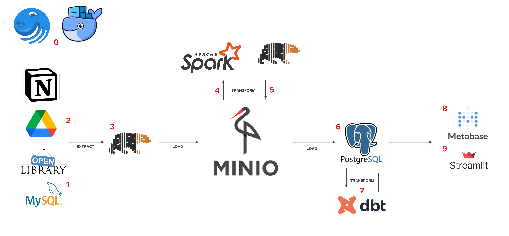
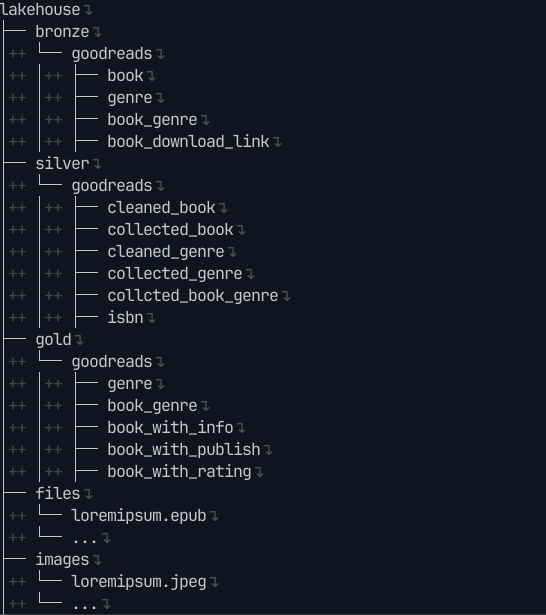
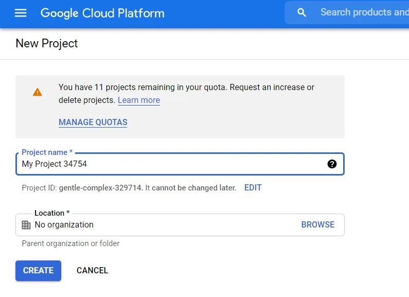
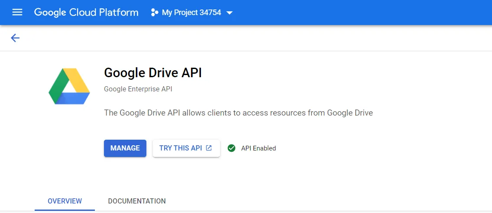

Trong project này mình sẽ hướng dẫn xây dựng một data pipeline cơ bản theo mô hình ELT (extract - load - transform), sử dụng bộ dữ liệu từ goodreads để ingest, transform data phục vụ hệ thống recommend sách cho bản thân.

Project này hoàn thành dựa trên kiến thức đã học được từ khóa Fundamental Data Engineering 02 của AIDE. Xin gửi lời cảm ơn đặc biệt tới thầy Nguyễn Thanh Bình, anh Ông Xuân Hồng và anh Hùng Lê.


</br>


Demo video

</br>

<iframe
    src="https://www.facebook.com/plugins/video.php?href=https%3A%2F%2Fwww.facebook.com%2Faideinstitutevietnam%2Fvideos%2F622101275993767%2F&show_text=false&t=9600"
    style="border:none;overflow:hidden"
    width=100%
    height=350
    scrolling="no"
    frameborder="0"
    allowfullscreen="true"
    allow="autoplay; clipboard-write; encrypted-media; picture-in-picture; web-share"
    allowFullScreen="true">
</iframe>

## 1. Introduction

Mình thích đọc sách. Và mình có một chiếc máy đọc sách kindle dùng cho việc đọc hàng ngày.


Có một điểm mình thích ở chiếc kindle là nó có một địa chỉ email riêng biệt được amazon cấp phát. Nếu sử dụng email của mình để gửi file sách (dạng .epub/.mobi), hệ thống trên amazon sẽ tự động gửi file sách vào kindle giúp mình, miễn là có kết nối mạng.

Thế thì tại sao mình không tự build một app, có thể lấy data từ goodreads (một mạng xã hội cho các mọt sách), xử lý và đưa ra lời gợi ý cho những cuốn sách tiếp theo cho mình nhỉ? Và thế là project bắt đầu :D

## 2. Objective

Dataset cơ bản được lấy từ [Kaggle](https://www.kaggle.com/datasets/bahramjannesarr/goodreads-book-datasets-10m), [OpenLibrary API](https://openlibrary.org), [Google Drive API](https://developers.google.com/drive) và [Notion API](https://www.notion.so/lelouvincx/9dca269701b44d6b944c51a7f63b5b5a?v=4852b4d5cf8440e4bc232b0e25327f93)

Mục tiêu của project, là với nguồn data được thu thập và xử lý sẵn, khi người dùng nhập thông tin cuốn sách đã đọc, có thể gợi ý các cuốn sách tiếp theo. Nếu cuốn sách đó có file .epub, app sẽ hiện tính năng gửi sách vào kindle.

## 3. Design

### 3.1 Directory tree


- `app`: Giao diện để tương tác với người dùng, viết bằng streamlit
- `dagster_home`: Config cho dagit (dagster UI) và dagster daemon
- `dataset`: Lưu dataset dưới dạng .csv, mặc định load vào MySQL
- `docker-compose`: Compose docker containers
- `dockerimages`: Chứa các image tự build như dagster (dagit + daemon), spark master, streamlit app
- `EDA.ipynb`: Exploratory Data Analysis, xem trực tiếp [tại đây](https://gist.github.com/lelouvincx/a88fa6caf59d7ff76086ab485ecc69bd)
- `elt_pipeline`: Toàn bộ pipeline
  - `dbt_transform`: code location của dbt, dùng cho bước transform ở cuối
  - `Dockerfile + requirements.txt`: Thông tin build image
  - `elt_pipeline`: pipeline từ đầu tới trước dbt
- `.env + .spark_master.env + .spark_worker.env`: Lưu biến môi trường (ví dụ POSTGRES_USER, MYSQL_USER, SPARK, ...)
- `env.template`: Template để bạn tự điền thông tin biến môi trường
- `.git + .gitignore`: Thuộc git, quản lý code version
- `Makefile`: Shortcut câu lệnh trên terminal
- `load_dataset`: Chứa script .sql để tạo schema và load vào database MySQL và Postgres
- `requirements.txt + Pipfile + Pipfile.lock`: Dependencies của python

Ngoài ra còn có các thư mục sở hữu riêng của container:

- `minio`
- `storage`
  - `mysql_data`
  - `postgres_data`
  - `metabase_data`

Chi tiết xem ở file [tree.txt](https://github.com/lelouvincx/goodreads-elt-pipeline/blob/main/tree.txt)

### 3.2 Pipeline design



0. Ta sử dụng `docker` để đóng gói ứng dụng và `dagster` để orchestrate assets (theo [định nghĩa](https://docs.dagster.io/concepts/assets/software-defined-assets) của daster)
1. Dữ liệu Goodreads được download từ kaggle dưới dạng `.csv`, sau đó import vào `MySQL` mô phỏng dữ liệu development
2. Sau khi có thông tin `ISBN` (mã định danh quốc tế) của sách, tiến hành collect thêm data từ các api liên quan
   - Genre, author, pages number, image, description từ `OpenLibrary API`
   - Download link từ `Notion API`
   - Epub file từ `Google Drive API`
   - Image từ `OpenLibrary API` hoặc `Google Drive API`
3. Extract dữ liệu dạng bảng ở trên bằng `polars`, load vào datalake - `MinIO`
4. Từ `MinIO` load ra `spark` để transform thành layer silver và gold
5. Convert `Spark DataFrame` thành `parquet`, load lại vào `MinIO`
6. Gold layer được load tiếp vào data warehouse - `postgreSQL`, tạo thành warehouse layer
7. Transform tùy mục đích bằng `dbt` trên nền `postgres`
8. Trực quan hóa dữ liệu bằng `metabase`
9. Giao diện app gợi ý sách bằng `streamlit`

### 3.3 Database schema


1. `book`: OLTP table chứa thông tin cuốn sách (ISBN, Authors, Rating, Description...)
2. `genre`: table chứa tên các thể loại sách
3. `book_genre`: quan hệ n-n giữa `book` và `genre`
4. `book_download_link`: table chứa link google drive để tham chiếu `BookFile`
5. `files`: object storage chứa file download sách (.epub/.pdf/.mobi)
6. `images`: object storage chứa hình ảnh cuốn sách

### 3.4 Datalake structure



1. Datalake chia theo các layer: bronze, silver, gold
2. Các loại file đều dạng .parquet để cho kết quả đọc tốt hơn .csv
3. Ngoài ra có files: lưu file .epub theo dạng abc.epub, trong đó abc là ISBN của cuốn sách
4. Tương tự, abc.jpeg lưu hình ảnh của cuốn sách

### 3.5 Data lineage

1. Tổng quan


Với data lineage dày đặc, dagster là big help khi có thể visualize chúng một cách trực quan:

- Dữ liệu xuất phát từ MySQL và các loại API, load vào bronze layer
- Từ bronze layer, dữ liệu được dedupe, clean và fill missing ở silver layer
- Sau đó tính toán nâng cao và phân tách ở gold layer
- Load vào data warehouse - Postgres ở warehouse layer
- Và cuối cùng, transform theo nhu cầu ở recommendations layer bằng dbt

2. Bronze layer


Gồm các asset:

- bronze_book: Bảng `book` từ MySQL, vì quá lớn (trên 1.2 triệu dòng nên được partitions theo năm từ 1975 tới 2022)
- bronze_genre: Bảng `genre` từ MySQL
- bronze_book_genre: Bảng `book_genre` từ MySQL
- bronze_book_download_link: Bảng `book_download_link` từ MySQL
- bronze_images_and_files_download: Đảm nhận việc kết nối tới google drive api, kéo file .epub và hình ảnh về, lưu trong datalake

3. Silver layer


Gồm các asset:

- silver_cleaned_book: Clean data từ upstream `bronze_book`, được partition để đảm bảo `spark standalone mode` có thể chạy
- silver_collected_book: Collect thêm missing data từ upstream như authors, pages number, description từ `OpenLibrary API`
- silver_isbn: Tách cột isbn từ `book` để làm dependency cho asset liên quan tới `genre`
- silver_cleaned_genre: Tương tự `silver_cleaned_book`, khác cái không cần partition vì size không lớn lắm
- silver_collected_genre: Dựa vào `silver_isbn`, collect thêm genre cho mỗi cuốn sách bị thiếu genre. Nếu không có genre thì không thể làm recommendations cho các task sau
- silver_collected_book_genre: Kết nối quan hệ n-n giữa `book` và `genre`

4. Gold layer


Gồm các asset:

- gold_genre: Tính toán, sắp xếp các genre cho phù hợp từ upstream `silver_collected_genre`, đồng thời lưu vào minIO
- gold_book_genre: Tương tự, từ upstream `silver_collected_book_genre`
- gold_with_info: Phân tách, chỉ chứa thông tin cơ bản về cuốn sách như ISBN, Name, Authors, Language, PagesNumber
- gold_with_publish: Phân tách, chỉ chứa thông tin về nhà xuất bản, thời gian xuất bản
- gold_with_rating: Phân tách và tính toán các loại rating

5. Warehouse layer


Load các asset từ gold layer vào postgres. Trong đó có 1 asset từ bronze layer là book_download_link.

Trong tương lai sẽ cập nhật asset để bổ sung download link tự động từ Notion API, và thiết lập schedule.

6. Transform layer


Gồm các model (asset):

- search: Transform thông tin để tạo bảng index, khi người dùng tìm kiếm sẽ query trên bảng này
- search_prior: Cũng là bảng index, nhưng chứa các cuốn sách được ưu tiên hơn dựa vào việc có download link, OpenLibrary API hoạt động, rating cao, ...
- criteria: Tiêu chí để query những cuốn sách liên quan khi tìm kiếm 1 cuốn sách

## 4. Setup

### 4.1 Prequisites

Để sử dụng pipeline này, download những phần mềm sau:

1. [Git](https://git-scm.com/book/en/v2/Getting-Started-Installing-Git)
2. [Docker](https://docs.docker.com/engine/install/) ít nhất 4GB RAM, 6 core CPU, 2GB swap, 16GB disk
3. [CMake](https://cmake.org/install/), nếu dùng hệ máy UNIX (Linux/MacOS), check `make --version` được cài sẵn
4. Python 3.x (3.9.16 recommended vì image của spark chạy trên version này, khuyến khích cài bằng asdf) và môi trường ảo (pipenv recommended)
5. Máy local đã free các port sau: 3306, 5432, 9000, 9001, 3001, 8501, 4040, 7077, 8080, 3030
6. Dbeaver hoặc một db client bất kỳ (nếu không có thể dùng command-line)


Nếu dùng Windows, setup thêm WSL2 và một máy ảo local Ubuntu, cài đặt những thứ trên cho ubuntu.


Clone project về:

```bash
git clone https://github.com/lelouvincx/goodreads-elt-pipeline.git project
cd project
```

Download dataset [ở đây](https://www.kaggle.com/datasets/lelouvincx/goodreads-elt-pipeline?select=book.csv), sau đó đặt 4 file `.csv` vào `project/dataset`.

### 4.2 Setup google drive api

Đầu tiên chúng ta cần tạo một OAuth 2.0 token tới google, [Google API Console](https://console.developers.google.com/).

Chọn `create new project` để mở hộp thoại.


Điền tên của project vào (goodreads-elt_pipeline), tùy chọn location của bạn (mặc định `No organization`).



Sau khi tạo xong project, chọn tab `Library`.


Search `Google Drive API`, enable nó.




Tiếp theo, chọn tab `OAuth consent screen`,


Điền thông tin như dưới


Ở mục `scopes`, chọn `add or remove scopes`, tìm `google drive api, readonly` rồi tick vào, `save and continue` tới hết


Vào tab `credentials` -> `create credentials` và chọn `OAuth client ID`.


Chọn `Desktop app`, đặt tên tùy thích (goodreads-elt-pipeline)


Download json và đặt file vào `project/elt_pipeline/elt_pipeline`


### 4.3 Setup local infrastructure

Create env file

```bash
touch .env
cp env.template .env
touch .spark_master.env
cp spark_master.env.template .spark_master.env
touch .spark_worker.env
cp spark_worker.env.template .spark_worker.env
```

Sau đó điền thông tin biến môi trường vào 3 file env trên. Dưới đây là ví dụ:

```env
# MySQL
MYSQL_HOST=de_mysql
MYSQL_PORT=3306
MYSQL_DATABASE=goodreads
MYSQL_USER=admin
MYSQL_PASSWORD=admin123
MYSQL_ROOT_PASSWORD=root123

# PostgreSQL
POSTGRES_HOST=de_psql
POSTGRES_PORT=5432
POSTGRES_USER=admin
POSTGRES_PASSWORD=admin123
POSTGRES_DB=goodreads
POSTGRES_HOST_AUTH_METHOD=trust

# Google Drive
GDRIVE_CLIENT_SECRET_FILE=client_secret.json
GDRIVE_PICKLE_FILE=token_drive_v3.pickle
GDRIVE_API_NAME=drive
GDRIVE_API_VERSION=v3
GDRIVE_SCOPES=https://www.googleapis.com/auth/drive.readonly

# Dagster
DAGSTER_PG_HOSTNAME=de_psql
DAGSTER_PG_USERNAME=admin
DAGSTER_PG_PASSWORD=admin123
DAGSTER_PG_DB=postgres
DAGSTER_OVERALL_CONCURRENCY_LIMIT=1
DAGSTER_HOME=/opt/dagster/dagster_home

# dbt
DBT_HOST=de_psql
DBT_USER=admin
DBT_PASSWORD=admin123
DBT_DATABASE=goodreads
DBT_SCHEMA=recommendations
# MinIO
MINIO_ENDPOINT=minio:9000
MINIO_ROOT_USER=minio
MINIO_ROOT_PASSWORD=minio123
MINIO_ACCESS_KEY=minio
MINIO_SECRET_KEY=minio123
DATALAKE_BUCKET=lakehouse
AWS_ACCESS_KEY_ID=minio
AWS_SECRET_ACCESS_KEY=minio123
AWS_REGION=us-east-1

# MinIO client (mc)
AWS_ACCESS_KEY_ID=minio
AWS_SECRET_ACCESS_KEY=minio123
AWS_REGION=us-east-1

# Spark
SPARK_MASTER_URL=spark://spark-master:7077
SPARK_VERSION=3.3.2
HADOOP_VERSION=3

# Metabase
MB_DB_TYPE=postgres
MB_DB_DBNAME=goodreads
MB_DB_PORT=5432
MB_DB_USER=admin
MB_DB_PASS=admin123
MB_DB_HOST=de_psql
MB_DB_FILE=/metabase_data/metabase.db
```

Bạn có thể thay các thông tin về user, pasword, ...


Chỉ dùng cho môi trường development, không dùng cho testing, staging, production.


Chạy các lệnh sau để setup:

```bash
# DO NOT RUN BOTH BELOW COMMANDS, ONLY CHOOSE ONE
# Setup python environment
pipenv install
# Or create virtualenv and install manually by requirements.txt
make install

# Build docker images
make build-dagster
make build-spark
make build-pipeline
make build-streamlit

# Run containers dettached
make up-bg

# Check running containers
docker compose ps -a

# Check code quality
make check
make lint

# Format pipelines
black ./elt_pipeline

# Test coverage
make test
```


Lúc này sẽ có 11 services sau đang chạy:




**Ports**


- MySQL: 3306
- PostgreSQL: 5432
- Dagit: 3001
- MinIO
  - UI: 9001
  - API: 9000
- Spark master:
  - UI: 8080
  - API: 7077
- Pipeline:
  - Spark jobs running: 4040
- Metabase: 3030
- Streamlit: 8501

### 4.4 Import data into MySQL

Bây giờ chúng ta import dataset goodreads (dạng csv) vào MySQL. Source từng file theo thứ tự:

```bash
make to_mysql_root
```

```sql
SET GLOBAL local_infile=TRUE;
-- Check if local_infile was turned on
SHOW VARIABLES LIKE "local_infile";
exit
```

```bash
# Create tables with schema
make mysql_create

# Load csv into created tables
make mysql_load
```

### 4.5 Create schema in Postgres

```bash
make psql_create
```

### 4.6 User interfaces

1. <http://localhost:3001> - Dagit
2. <http://localhost:4040> - Spark jobs
3. <http://localhost:8080> - Spark master
4. <http://localhost:9001> - MinIO
5. <http://localhost:3030> - Metabase
6. <http://localhost:8501> - Streamlit

## 5. Detailed code walkthrough

### 5.1 Exploratory Data Analysis

Chi tiết xem ở [gist](https://gist.github.com/lelouvincx/a88fa6caf59d7ff76086ab485ecc69bd)

### 5.2 Extract (MySQL/API)

`mysql_io_manager`

```python
def connect_mysql(config) -> str:
    conn_info = (
        f"mysql://{config['user']}:{config['password']}"
        + f"@{config['host']}:{config['port']}"
        + f"/{config['database']}"
    )
    return conn_info

def extract_data(self, sql: str) -> pl.DataFrame:
    """
    Extract data from MySQL database as polars DataFrame
    """
    conn_info = connect_mysql(self._config)
    df_data = pl.read_database(query=sql, connection_uri=conn_info)
    return df_data
```

`constants`

```python
COMPUTE_KIND = "SQL"
LAYER = "bronze"
YEARLY = StaticPartitionsDefinition(
    [str(year) for year in range(1975, datetime.today().year)]
)
```

`bronze_book`

```python
# book from my_sql
@asset(
    description="Load table 'book' from MySQL database as polars DataFrame, and save to minIO",
    partitions_def=YEARLY,
    io_manager_key="minio_io_manager",
    required_resource_keys={"mysql_io_manager"},
    key_prefix=["bronze", "goodreads"],
    compute_kind=COMPUTE_KIND,
    group_name=LAYER,
)
def bronze_book(context) -> Output[pl.DataFrame]:
    query = "SELECT * FROM book"
    try:
        partion_year_str = context.asset_partition_key_for_output()
        partition_by = "PublishYear"
        query += f" WHERE {partition_by} = {partion_year_str}"
        context.log.info(f"Partition by {partition_by} = {partion_year_str}")
    except Exception:
        context.log.info("No partition key found, full load data")

    df_data = context.resources.mysql_io_manager.extract_data(query)
    context.log.info(f"Table extracted with shape: {df_data.shape}")

    return Output(
        value=df_data,
        metadata={
            "table": "book",
            "row_count": df_data.shape[0],
            "column_count": df_data.shape[1],
            "columns": df_data.columns,
        },
    )
```

`bronze_genre`

```python
# genre from my_sql
@asset(
    description="Load table 'genre' from MySQL database as polars DataFrame, and save to minIO",
    io_manager_key="minio_io_manager",
    required_resource_keys={"mysql_io_manager"},
    key_prefix=["bronze", "goodreads"],
    compute_kind=COMPUTE_KIND,
    group_name=LAYER,
)
def bronze_genre(context) -> Output[pl.DataFrame]:
    query = "SELECT * FROM genre;"
    df_data = context.resources.mysql_io_manager.extract_data(query)
    context.log.info(f"Table extracted with shape: {df_data.shape}")

    return Output(
        value=df_data,
        metadata={
            "table": "genre",
            "row_count": df_data.shape[0],
            "column_count": df_data.shape[1],
            "columns": df_data.columns,
        },
    )
```

Các asset khác tương tự.

### 5.3 Load (datalake - minIO)

`minio_io_manager`

```python
@contextmanager
def connect_minio(config):
    client = Minio(
        endpoint=config.get("endpoint_url"),
        access_key=config.get("minio_access_key"),
        secret_key=config.get("minio_secret_key"),
        secure=False,
    )

    try:
        yield client
    except Exception as e:
        raise e
```

```python
# Make bucket if not exists
def make_bucket(client: Minio, bucket_name):
    found = client.bucket_exists(bucket_name)
    if not found:
        client.make_bucket(bucket_name)
    else:
        print(f"Bucket {bucket_name} already exists.")
```

```python
    def _get_path(self, context: Union[InputContext, OutputContext]):
        # E.g context.asset_key.path: ['bronze', 'goodreads', 'book']
        layer, schema, table = context.asset_key.path
        # NOTE: E.g: bronze/goodreads/book
        key = "/".join([layer, schema, table.replace(f"{layer}_", "")])
        # E.g /tmp/file_bronze_goodreads_book_20210101000000.parquet
        tmp_file_path = "/tmp/file_{}_{}.parquet".format(
            "_".join(context.asset_key.path), datetime.today().strftime("%Y%m%d%H%M%S")
        )  # Partition by year

        if context.has_partition_key:
            # E.g partition_str: book_2021
            partition_str = str(table) + "_" + context.asset_partition_key
            # E.g key_name: bronze/goodreads/book/book_2021.parquet
            # tmp_file_path: /tmp/file_bronze_goodreads_book_20210101000000.parquet
            return os.path.join(key, f"{partition_str}.parquet"), tmp_file_path
        else:
            # E.g key_name: bronze/goodreads/book.parquet
            return f"{key}.parquet", tmp_file_path
```

```python
    def handle_output(self, context: "OutputContext", obj: pl.DataFrame):
        key_name, tmp_file_path = self._get_path(context)

        # Convert from polars DataFrame to parquet format
        obj.write_parquet(tmp_file_path)

        # Upload file to minIO
        try:
            bucket_name = self._config.get("bucket")
            with connect_minio(self._config) as client:
                # Make bucket if not exist
                make_bucket(client, bucket_name)

                # Upload file to minIO
                # E.g bucket_name: lakehouse,
                # key_name: bronze/goodreads/book/book_2021.parquet,
                # tmp_file_path: /tmp/file_bronze_goodreads_book_20210101000000.parquet
                client.fput_object(bucket_name, key_name, tmp_file_path)
                context.log.info(
                    f"(MinIO handle_output) Number of rows and columns: {obj.shape}"
                )
                context.add_output_metadata({"path": key_name, "tmp": tmp_file_path})

                # Clean up tmp file
                os.remove(tmp_file_path)
        except Exception as e:
            raise e
```

```python
    def load_input(self, context: "InputContext") -> pl.DataFrame:
        """
        Prepares input for downstream asset,
        and downloads parquet file from minIO and converts to polars DataFrame
        """

        bucket_name = self._config.get("bucket")
        key_name, tmp_file_path = self._get_path(context)

        try:
            with connect_minio(self._config) as client:
                # Make bucket if not exist
                make_bucket(client=client, bucket_name=bucket_name)

                # E.g bucket_name: lakehouse,
                # key_name: bronze/goodreads/book/book_2021.parquet,
                # tmp_file_path: /tmp/file_bronze_goodreads_book_20210101000000.parquet
                context.log.info(f"(MinIO load_input) from key_name: {key_name}")
                client.fget_object(bucket_name, key_name, tmp_file_path)
                df_data = pl.read_parquet(tmp_file_path)
                context.log.info(
                    f"(MinIO load_input) Got polars dataframe with shape: {df_data.shape}"
                )

                return df_data
        except Exception as e:
            raise e
```

### 5.4 Transform (spark)

```python
# Silver cleaned book
@asset(
    description="Load book table from bronze layer in minIO, into a Spark dataframe, then clean data",
    partitions_def=YEARLY,
    ins={
        "bronze_book": AssetIn(
            key_prefix=["bronze", "goodreads"],
        ),
    },
    io_manager_key="spark_io_manager",
    key_prefix=["silver", "goodreads"],
    compute_kind=COMPUTE_KIND,
    group_name=LAYER,
)
def silver_cleaned_book(context, bronze_book: pl.DataFrame):
    """
    Load book table from bronze layer in minIO, into a Spark dataframe, then clean data
    """

    config = {
        "endpoint_url": os.getenv("MINIO_ENDPOINT"),
        "minio_access_key": os.getenv("MINIO_ACCESS_KEY"),
        "minio_secret_key": os.getenv("MINIO_SECRET_KEY"),
    }

    context.log.debug("Start creating spark session")

    with get_spark_session(config, str(context.run.run_id).split("-")[0]) as spark:
        # Convert bronze_book from polars DataFrame to Spark DataFrame
        pandas_df = bronze_book.to_pandas()
        context.log.debug(
            f"Converted to pandas DataFrame with shape: {pandas_df.shape}"
        )

        spark_df = spark.createDataFrame(pandas_df)
        spark_df.cache()
        context.log.info("Got Spark DataFrame")

        # Dedupe books
        spark_df = spark_df.dropDuplicates()
        # Drop rows with null value in column 'Name'
        spark_df = spark_df.na.drop(subset=["Name"])
        # Drop rows with null values in column ISBN
        spark_df = spark_df.na.drop(subset=["isbn"])
        # Drop rows will null values in column 'Language'
        spark_df = spark_df.na.drop(subset=["Language"])
        # Drop rows with value '--' in column 'Language'
        spark_df = spark_df.filter(spark_df.Language != "--")
        # Drop rows with value > 350 in column 'PagesNumber'
        spark_df = spark_df.filter(spark_df.PagesNumber <= 350)
        # Drop column 'CountsOfReview' (overlap with 'RatingDistTotal')
        spark_df = spark_df.drop("CountsOfReview")
        # Choose rows with 'PublishYear' from 1900 to datetime.today().year
        spark_df = spark_df.filter(
            (spark_df.PublishYear >= 1975)
            & (spark_df.PublishYear <= datetime.today().year)
        )
        # Update value of column 'RatingDist...', splitting by ':' and take the second value
        spark_df = spark_df.withColumn(
            "RatingDist5", split_take_second(col("RatingDist5"))
        )
        spark_df = spark_df.withColumn(
            "RatingDist4", split_take_second(col("RatingDist4"))
        )
        spark_df = spark_df.withColumn(
            "RatingDist3", split_take_second(col("RatingDist3"))
        )
        spark_df = spark_df.withColumn(
            "RatingDist2", split_take_second(col("RatingDist2"))
        )
        spark_df = spark_df.withColumn(
            "RatingDist1", split_take_second(col("RatingDist1"))
        )
        spark_df = spark_df.withColumn(
            "RatingDistTotal", split_take_second(col("RatingDistTotal"))
        )
        # Cast column 'RatingDist...' to Interger
        spark_df = spark_df.withColumn(
            "RatingDist5", spark_df.RatingDist5.cast("Integer")
        )
        spark_df = spark_df.withColumn(
            "RatingDist4", spark_df.RatingDist4.cast("Integer")
        )
        spark_df = spark_df.withColumn(
            "RatingDist3", spark_df.RatingDist3.cast("Integer")
        )
        spark_df = spark_df.withColumn(
            "RatingDist2", spark_df.RatingDist2.cast("Integer")
        )
        spark_df = spark_df.withColumn(
            "RatingDist1", spark_df.RatingDist1.cast("Integer")
        )
        spark_df = spark_df.withColumn(
            "RatingDistTotal", spark_df.RatingDistTotal.cast("Integer")
        )
        # Change column name 'Count of text reviews' to 'CountOfTextReviews'
        spark_df = spark_df.withColumnRenamed(
            "Count of text reviews", "CountOfTextReviews"
        )
        # Change value of column 'Language' from ['en-US', 'en-GB', 'en-CA'],  to 'eng', from 'nl' to 'nld'
        spark_df = spark_df.withColumn(
            "Language", regexp_replace("Language", "en-US", "eng")
        )
        spark_df = spark_df.withColumn(
            "Language", regexp_replace("Language", "en-GB", "eng")
        )
        spark_df = spark_df.withColumn(
            "Language", regexp_replace("Language", "en-CA", "eng")
        )
        spark_df = spark_df.withColumn(
            "Language", regexp_replace("Language", "nl", "nld")
        )

        spark_df.unpersist()

        return Output(
            value=spark_df,
            metadata={
                "table": "silver_cleaned_book",
                "row_count": spark_df.count(),
                "column_count": len(spark_df.columns),
                "columns": spark_df.columns,
            },
        )
```

```python
# Silver collected book
@asset(
    description="Collect more infomation about cleaned books, such as authors, number of pages",
    partitions_def=YEARLY,
    ins={
        "silver_cleaned_book": AssetIn(
            key_prefix=["silver", "goodreads"],
            metadata={"full_load": False},
        ),
    },
    io_manager_key="spark_io_manager",
    key_prefix=["silver", "goodreads"],
    compute_kind="OpenLibrary API",
    group_name=LAYER,
)
def silver_collected_book(context, silver_cleaned_book: DataFrame) -> Output[DataFrame]:
    """
    Collect more infomation about cleaned books
    - Authors: if missing
    - Number of pages: if missing
    """

    spark_df = silver_cleaned_book
    context.log.debug("Caching spark_df ...")
    spark_df.cache()

    context.log.info("Starting filling missing data ...")
    null_authors_df = spark_df.filter(
        (spark_df.Authors.isNull()) | (spark_df.Authors == "")
    )
    null_pages_number_df = spark_df.filter((spark_df.PagesNumber.isNull()))

    count = 0
    for row in null_authors_df.select("ISBN").collect():
        isbn = row[0]
        context.log.debug(f"Got isbn: {isbn}")
        if isbn is not None:
            # Get request from OpenLibrary API
            req = requests.get(
                f"https://openlibrary.org/api/books?bibkeys=ISBN:{isbn}&format=json&jscmd=data"
            )
            json = req.json()
            if len(json.keys()) > 0:
                context.log.debug("Got json with data")
                # Check if spark_df with column 'ISBN' = isbn has missing value in column 'Authors'
                row_from_df = spark_df.filter(spark_df.ISBN == isbn).collect()[0]
                if row_from_df.Authors is None or row_from_df.Authors is "":
                    context.log.debug("Authors is missing, start filling ...")
                    # Take the first author
                    author = json.get(f"ISBN:{isbn}" or {}).get("authors" or [])
                    author = author[0].get("name") if len(author) > 0 else None
                    if author:
                        count += 1
                        # Update spark_df with column 'ISBN' = isbn and column 'Authors' = author
                        spark_df = spark_df.withColumn(
                            "Authors",
                            when(
                                (spark_df.ISBN == isbn)
                                & (
                                    (spark_df.Authors.isNull())
                                    | (spark_df.Authors == "")
                                ),
                                author,
                            ).otherwise(spark_df.Authors),
                        )
    context.log.info(f"Filled in {count} authors")

    count = 0
    for row in null_pages_number_df.select("ISBN").collect():
        isbn = row[0]
        context.log.debug(f"Got isbn: {isbn}")
        if isbn is not None:
            # Get request from OpenLibrary API
            req = requests.get(
                f"https://openlibrary.org/api/books?bibkeys=ISBN:{isbn}&format=json&jscmd=data"
            )
            json = req.json()
            if len(json.keys()) > 0:
                context.log.debug("Got json with real data")
                # Check if spark_df with column 'ISBN' = isbn has missing value in column 'Authors'
                row_from_df = spark_df.filter(spark_df.ISBN == isbn).collect()[0]
                # Check if spark_df with column 'ISBN' = isbn has missing value in column 'PagesNumber'
                if row_from_df.PagesNumber is None or row_from_df.PagesNumber == 0:
                    context.log.debug("PagesNumber is missing, start filling ...")
                    # Take the number of pages
                    pages_number = json.get(f"ISBN:{isbn}" or {}).get("number_of_pages")
                    if pages_number:
                        count += 1
                        # Update spark_df with column 'ISBN' = isbn and column 'PagesNumber' = pages_number
                        spark_df = spark_df.withColumn(
                            "PagesNumber",
                            when(
                                (spark_df.ISBN == isbn)
                                & (spark_df.PagesNumber.isNull()),
                                pages_number,
                            ).otherwise(spark_df.PagesNumber),
                        )
    context.log.info(f"Filled in {count} pages numbers")

    spark_df.unpersist()

    return Output(
        value=spark_df,
        metadata={
            "table": "silver_collected_book",
            "row_count": spark_df.count(),
            "column_count": len(spark_df.columns),
            "columns": spark_df.columns,
        },
    )
```

### 5.5 Load (data warehouse - Postgres)

`psql_io_manager`

```python
@contextmanager
def connect_psql(config):
    try:
        yield psycopg2.connect(
            host=config["host"],
            port=config["port"],
            database=config["database"],
            user=config["user"],
            password=config["password"],
        )
    except (Exception) as e:
        print(f"Error while connecting to PostgreSQL: {e}")
```

```python
    def handle_output(self, context: "OutputContext", obj: pl.DataFrame):
        # E.g context.asset_key.path = ['warehouse', 'gold', 'book_genre']
        schema = context.asset_key.path[-2]
        # NOTE: Replace pattern is 'warehouse', not general
        table = str(context.asset_key.path[-1]).replace("warehouse_", "")
        context.log.debug(f"Schema: {schema}, Table: {table}")
        tmp_tbl = f"{table}_tmp_{datetime.now().strftime('%Y_%m_%d')}"
        try:
            with connect_psql(self._config) as conn:
                context.log.debug(f"Connected to PostgreSQL: {conn}")
                primary_keys = (context.metadata or {}).get("primary_keys", [])
                context.log.debug(f"Primary keys: {primary_keys}")

                with conn.cursor() as cursor:
                    context.log.debug(f"Cursor info: {cursor}")
                    cursor.execute("SELECT version()")
                    context.log.info(f"PostgreSQL version: {cursor.fetchone()}")
                    # Create temp file
                    cursor.execute(
                        f"CREATE TEMP TABLE IF NOT EXISTS {tmp_tbl} (LIKE {schema}.{table})"
                    )
                    cursor.execute(f"SELECT COUNT(*) FROM {tmp_tbl}")
                    context.log.debug(
                        f"Log for creating temp table: {cursor.fetchone()}"
                    )
                    # Create sql identifiers for the column names
                    # Do this to safely insert into a sql query
                    columns = sql.SQL(",").join(
                        sql.Identifier(name.lower()) for name in obj.columns
                    )
                    # Create a placeholder for the values. These will be filled later
                    values = sql.SQL(",").join(sql.Placeholder() for _ in obj.columns)
                    # Create the insert query
                    context.log.debug("Inserting data into temp table")
                    insert_query = sql.SQL("INSERT INTO {} ({}) VALUES({});").format(
                        sql.Identifier(tmp_tbl), columns, values
                    )
                    # Execute the insert query
                    psycopg2.extras.execute_batch(cursor, insert_query, obj.rows())
                    conn.commit()

                    # Check data inserted
                    context.log.debug("Checking data inserted")
                    cursor.execute(f"SELECT COUNT(*) FROM {tmp_tbl};")
                    context.log.info(f"Number of rows inserted: {cursor.fetchone()}")
                    # Upsert data
                    if len(primary_keys) > 0:
                        context.log.debug("Table has primary keys, upserting data")
                        conditions = " AND ".join(
                            [
                                f""" {schema}.{table}."{k}" = {tmp_tbl}."{k}" """
                                for k in primary_keys
                            ]
                        )
                        command = f"""
                            BEGIN TRANSACTION;
                            DELETE FROM {schema}.{table}
                            USING {tmp_tbl}
                            WHERE {conditions};

                            INSERT INTO {schema}.{table}
                            SELECT * FROM {tmp_tbl};

                            END TRANSACTION;
                        """
                    else:
                        context.log.debug("Table has no primary keys, replacing data")
                        command = f"""
                            BEGIN TRANSACTION;
                            DELETE FROM {schema}.{table};

                            INSERT INTO {schema}.{table}
                            SELECT * FROM {tmp_tbl};

                            END TRANSACTION;
                        """

                    # context.log.debug(f"Command: {command}")
                    context.log.debug(f"Upserting data into {schema}.{table}")
                    cursor.execute(command)
                    context.log.debug(f"{cursor.statusmessage}")
                    conn.commit()
        except (Exception) as e:
            print(f"Error while handling output to PostgreSQL: {e}")

        try:
            with connect_psql(self._config) as conn:
                with conn.cursor() as cursor:
                    context.log.debug(f"{cursor.fetchone()}")
                    cursor.execute(f"SELECT COUNT(*) FROM {schema}.{table};")
                    context.log.info(
                        f"Number of rows upserted in {schema}.{table}: {cursor.fetchone()}"
                    )

                    # Drop temp table
                    cursor.execute(f"DROP TABLE {tmp_tbl}")
                    conn.commit()
        except (Exception) as e:
            print(f"Error while testing handle_output to PostgreSQL: {e}")
```

### 5.6 Transform (dbt)

`search`

```sql
select
  isbn,
  name
from {{ source('gold', 'book_with_info') }}
```

`search_prior`

```sql
select
  isbn,
  name
from {{ source('gold', 'book_with_info') }}
right join {{ source('recommendations', 'book_download_link') }} using (isbn)
where link is not null
```

`criteria`

```sql
with tmp_avg_rating as (
  select
    isbn,
    rating
  from {{ source('gold', 'book_with_rating') }}
),
tmp_download_link as (
  select
    isbn,
    case
      when link is null then 0
      else 1
    end as hasdownloadlink,
    rating
  from {{ source('recommendations', 'book_download_link') }}
  right join tmp_avg_rating using (isbn)
)

select *
from tmp_download_link
```

## 6. Tear down infrastructure

Dỡ bỏ containers sau khi xong việc

```bash
make down
```

## 7. Considerations

Giờ là lúc đánh giá project:

1. Tốc độ: `spark` được cài ở chế độ standalone nên không đạt hiệu suất cao, đôi khi bị crash giữa chừng khi thực hiện các task shuffle/read/write
2. Môi trường phát triển: Hiện tại mới có develop, tương lai sẽ xem xét môi trường testing, staging, production
3. `dbt` hiện tại là project nhỏ, tương lai nếu cần transform nhiều thì cần tách service riêng, phân quyền, ...
4. Deployment: Sử dụng một trong các dịnh vụ điện toán đám mây: AWS, Azure, GCP

## 8. Further actions

1. Hoàn thiện recommender system
2. Tích hợp jupyter notebook để làm task của data scientist - [dagstermill](https://docs.dagster.io/integrations/dagstermill)
3. Testing environment
4. Continuous Integration với Github Actions
