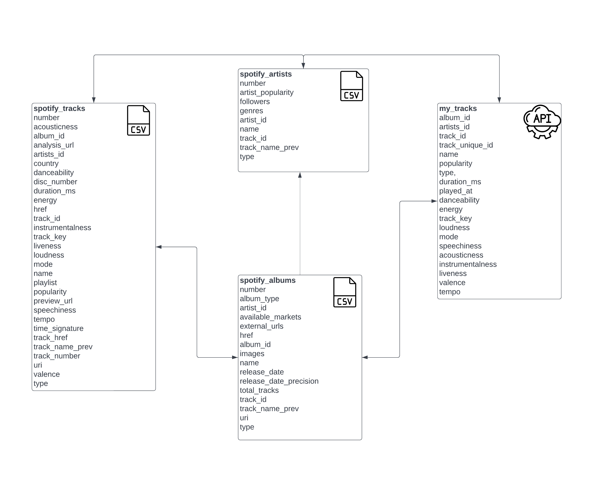
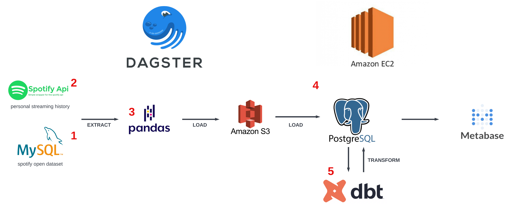
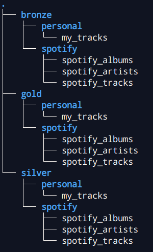
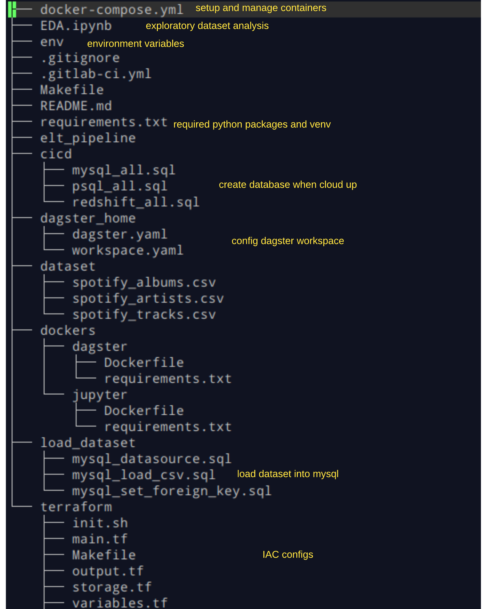
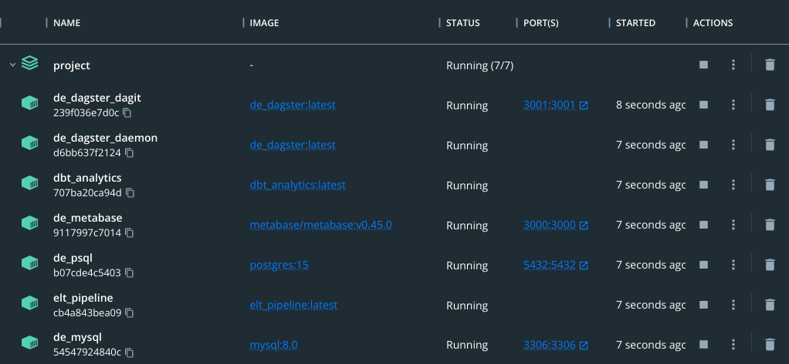
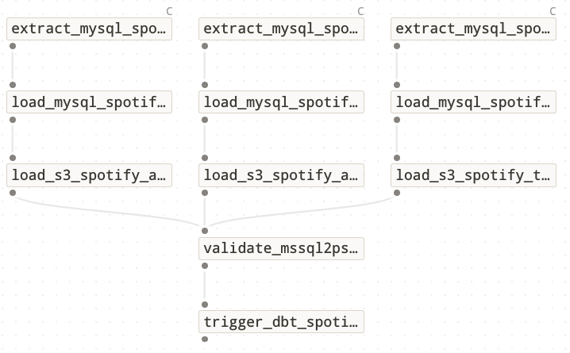
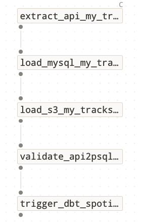

## 1. Introduction

Trong project này mình sẽ hướng dẫn xây dựng một data pipeline cơ bản theo mô hình ELT (extract - load - transform), sử dụng bộ dữ liệu từ spotify để phân tích xu hướng nghe nhạc.

Project này hoàn thành dựa trên kiến thức đã học được từ khóa Fundamental Data Engineering của AIDE. Xin gửi lời cảm ơn đặc biệt tới thầy Nguyễn Thanh Bình, anh Ông Xuân Hồng và anh Hùng Lê.

[Source code](https://gitlab.com/lelouvincx/fde01_project_fde220103_dinhminhchinh) của project.

## 2. Objective

Mục tiêu của project này là xây dựng một data pipeline để đưa dữ liệu của bảng `spotify_tracks` từ mySQL và `my_tracks` từ API của Spotify thành dashboard để phân tích. Các bảng được hỗ trợ bởi `spotify_albums` và `spotify_artists` như mô tả dưới đây:

1. `spotify_tracks`: OLTP table chứa thông tin bài hát từ spotify
2. `my_tracks`: lịch sử stream nhạc của bản thân, lấy schema giống `spotify_tracks`
3. `spotify_albums`: chứa thông tin albums từ dataset
4. `spotify_artists`: thông tin nghệ sĩ từ dataset



Chi tiết hơn xem ở: [Exploratory Data Analysis](https://gitlab.com/lelouvincx/fde01_project_fde220103_dinhminhchinh/-/blob/main/EDA.ipynb)

## 3. Design

### 3.1 Pipeline design

Chúng ta sử dụng máy ảo AWS EC2 để tính toán và [dagster](https://dagster.io/) để orchestrate tasks.

1. Dữ liệu spotify được download từ kaggle dưới dạng csv, sau đó import vào mySQL mô phỏng làm dữ liệu doanh nghiệp
2. Dữ liệu streaming history của bản thân được extract từ spotify API
3. Extract 2 nguồn dữ liệu trên bằng pandas để preprocessing (optimize size consumed)
4. Load vào Amazon S3, từ đó load tiếp vào data warehouse (PostgreSQL) để làm analytics
5. Transform dữ liệu bằng dbt trên nền PostgreSQL
6. Trực quan hóa dữ liệu bằng Metabase



### 3.2 Data lake structure

Chúng ta sử dụng AWS S3 làm data lake. Mọi dữ liệu trước hết sẽ được chứa ở đây. Trong project này, ta chỉ cần 1 bucket với nhiều thư mục.

1. **Bronze**: Lưu dữ liệu thô mới lấy về. Chúng là step 1, 2, 3 trong pipeline design
2. **Silver**: Lưu dữ liệu được tiền xử lý. Chúng là step 4 trong pipeline design
3. **Gold**: Lưu dữ liệu sạch khi transform bằng dbt (step 5)



### 3.3 Directory tree



- **docker-compose**: compose các container chạy trong docker
- **EDA**: khám phá dataset và profiling
- **.gitignore**: giúp git không track file (như env, cache, ...)
- **.gitlab-ci**: config quá trình CI trên gitlab
- **Makefile**: thu gọn câu lệnh
- **requirements.txt**: packages python cần thiết và thiết lập virtualenv
- Folder **dagser_home** chứa dagster.yaml để config thành phần dagster còn workspace.yaml để chỉ định dagster chạy host elt_pipeline
- Folder **dockers** chứa file config các container: dagster và jupyter
- Folder **load_dataset** chứa các file dùng để load dữ liệu ban đầu vào mySQL
- Folder **terraform** để khởi tạo và config server trên AWS

Chi tiết cây thư mục xem ở: [directory tree](https://gitlab.com/lelouvincx/fde01_project_fde220103_dinhminhchinh/-/blob/main/tree.txt)

## 4. Setup

### 4.1 Prequisites

Để sử dụng pipeline này, download những phần mềm sau:

1. [Git](https://git-scm.com/book/en/v2/Getting-Started-Installing-Git)
2. [Tài khoản gitlab](https://gitlab.com/)
3. [Terraform](https://learn.hashicorp.com/tutorials/terraform/install-cli)
4. [Tài khoản AWS](https://aws.amazon.com/)
5. [AWS CLI](https://docs.aws.amazon.com/cli/latest/userguide/install-cliv2.html) và [configure](https://docs.aws.amazon.com/cli/latest/userguide/cli-chap-configure.html)
6. [Docker](https://docs.docker.com/engine/install/) ít nhất 4GB RAM và [Docker Compose](https://docs.docker.com/compose/install/) ít nhất v1.29.2

Nếu dùng Windows, setup thêm WSL và một máy ảo local Ubuntu, cài đặt những thứ trên cho ubuntu.

### 4.2 Setup data infrastructure local

Clone repository:

```bash
git clone https://gitlab.com/lelouvincx/fde01_project_fde220103_dinhminhchinh.git
mv fde01_project_fde220103_dinhminhchinh project
cd project

# Create env file
touch env
cp env.template env
```

Điền các biến môi trường vào file env.

Chạy các lệnh sau để setup infra dưới local:

```bash
# Setup python packages
make install

# Build docker images
make build

# Run locally
make up

# Check running containers
docker ps

# Check code quality
make check
make lint

# Use black to reformat if any tests failed, then try again
black ./elt_pipeline

# Test coverage
make test
```

Lúc này sẽ có 7 services sau đang chạy:


Bây giờ chúng ta import dataset spotify (dạng csv) vào mySQL:

```bash
# Enter mysql cli
make to_mysql
```

```sql
SET GLOBAL local_infile=true;
-- Check if local_infile is turned on
SHOW VARIABLES LIKE "local_infile";
exit
```

Source từng file theo thứ tự:

```bash
# Create tables with schema
make mysql_create
# Load csv into created tables
make mysql_load
# Set their foreign keys
make mysql_set_foreign_key
```

Khởi tạo schema và table trong PostgreSQL:

```bash
# Enter psql cli
make psql_create
```

Testing:

```bash
# Test utils
python3 -m pytest -vv --cov=utils elt_pipeline/tests/utils
# Test ops
python3 -m pytest -vv --cov=ops elt_pipeline/tests/ops
```

Truy cập giao diện của pipeline bằng dagit: https://localhost:3001/

### 4.3 Setup data infrastructure on AWS

1. Chúng ta dùng terraform làm IaC (Infrastructure as Code) để setup hạ tầng trên AWS (nhớ [cấp credential key cho AWS](https://developer.hashicorp.com/terraform/tutorials/aws-get-started/aws-build) nhé)

```bash
cd terraform

# Initialize infra
make tf-init

# Checkout planned infra
make tf-plan

# Build up infra
make tf-up
```

Đợi một chút để setup xong. Chúng ta lên [Amazon Web Services](aws.amazon.com)

- Trong EC2 sẽ thấy 1 máy ảo tên project-spotify-EC2
  
- Trong S3 thấy 1 bucket tên project-spotify-bucket
  

Sau khi project-spotify-EC2 hiện đã pass hết status thì chúng ta đã setup thành công.

2. Bây giờ chúng ta truy cập vào EC2 để hoàn tất setup

```bash
# Connect to EC2 from local terminal
make ssh-ec2
# Generate new ssh key for gitlab
ssh-keygen
# Then press Enter until done
cat ~/.ssh/id_rsa.pub
```

- Copy đoạn mã SSH
- Vào gitlab, phía trên góc phải có hình avatar -> Preferences -> SSH Keys -> paste key vừa copy vào -> đặt tên là 'project-spotify-vm' -> Add key
- Vào terminal của EC2 (vừa connect lúc nãy), clone về bằng SSH
- Lặp lại bước setup infra local đã trình bày ở phần trên

## 5. Detailed code walkthrough

ELT pipeline gồm 2 job chạy 2 tác vụ độc lập: EL data từ MySQL và EL data từ API nhưng nhìn chung chúng có cấu trúc giống nhau. Cụ thể:

1. **extract*data_from*{mysql/api}**: Lấy data từ MySQL hoặc api (thông qua `access token`) và lưu tạm dưới dạng `pandas.DataFrame`. Tùy theo chiến lược ingest data (full load/incremental by partition/incremental by watermark) mà có cách giải quyết phù hợp.
2. **load_data_to_s3**: Tiền xử lý `data types` cho `DataFrame` từ upstream và load vào S3 dưới dạng parquet.
3. **load_data_to_psql**: Extract data dạng parquet trong S3 thành `pandas.DataFrame` và load vào PostgreSQL. Để dữ liệu được toàn vẹn (không bị crash, lỗi đường truyền) trong quá trình crash, ta tạo `TEMP TABLE` và load vào đó trước.
4. **validate\_{mssql2psql/api2psql}\_ingestion**: Thẩm định 3 step trên đã được EL thành công hay chưa
5. **trigger_dbt_spotify**: Sensor để trigger `dbt` nhằm transform data.


job_mssql2psql_ingestion




job_api2psql_ingestion



### 5.1 Extract

Lấy data từ MySQL hoặc api (thông qua `access token`) và lưu tạm dưới dạng `pandas.DataFrame`. Tùy theo chiến lược ingest data (full load/incremental by partition/incremental by watermark) mà có cách giải quyết phù hợp.

Ta định nghĩa phương thức extract data của mysql và api trong thư mục utils.


utils/mysql_loader/extract


```python
def extract_data(self, sql: str) -> pd.DataFrame:
    pd_data = None
    with self.get_db_connection() as db_conn:
        pd_data = pd.read_sql(sql, db_conn)
    return pd_data
```


utils/api_loader/get_recently


```python
def get_recently(self, number: int, token: str) -> (int, dict):
    headers = {
        "Accept": "application/json",
        "Content-Type": "application/json",
        "Authorization": f"Bearer " + token,
    }
    params = [("limit", number),]
    try:
        response = requests.get(
            "https://api.spotify.com/v1/me/player/recently-played",
            headers=headers,
            params=params,
            timeout=10,
        )
        return (response.status_code, response.json())
    except:
        return None
```


utils/api_loader/extract


```python
def extract_data(self, token: str) -> pd.DataFrame:
    (code, content) = self.get_recently(50, token)
    my_tracks = {
        "album_id": [], "artists_id": [], "track_id": [], "track_unique_id": [], "name": [], "popularity": [], "type": [], "duration_ms": [], "played_at": [], "danceability": [], "energy": [], "track_key": [], "loudness": [], "mode": [], "speechiness": [], "acousticness": [], "instrumentalness": [], "liveness": [], "valence": [], "tempo": [],
    }

    items = content.get("items", [])
    for item in items:
        # Take album_id, artists_id, track_id, name, popularity, type, duration_ms
        played_at = item.get("played_at", [])
        track = item.get("track", [])
        album = track.get("album", [])
        album_id = album.get("id", [])
        artists = track.get("artists", [])
        artists_id = []
        for artist in artists:
            artists_id.append(artist.get("id", []))
        track_id = track.get("id", [])
        name = track.get("name", [])
        popularity = track.get("popularity", [])
        type = track.get("type", [])
        duration_ms = track.get("duration_ms", [])

        # Take features
        features = self.get_features(track_id, token)
        danceability = features.get("danceability", [])
        energy = features.get("energy", [])
        track_key = features.get("key", [])
        loudness = features.get("loudness", [])
        mode = features.get("mode", [])
        speechiness = features.get("speechiness", [])
        acousticness = features.get("acousticness", [])
        instrumentalness = features.get("instrumentalness", [])
        liveness = features.get("liveness", [])
        valence = features.get("valence", [])
        tempo = features.get("tempo", [])

        # Extract row into dict
        my_tracks["album_id"].append(album_id)
        my_tracks["artists_id"].append(artists_id)
        my_tracks["track_id"].append(track_id)
        my_tracks["track_unique_id"].append(track_id + played_at)
        my_tracks["name"].append(name)
        my_tracks["popularity"].append(popularity)
        my_tracks["type"].append(type)
        my_tracks["duration_ms"].append(duration_ms)
        my_tracks["played_at"].append(played_at[:10])
        my_tracks["danceability"].append(danceability)
        my_tracks["energy"].append(energy)
        my_tracks["track_key"].append(track_key)
        my_tracks["loudness"].append(loudness)
        my_tracks["mode"].append(mode)
        my_tracks["speechiness"].append(speechiness)
        my_tracks["acousticness"].append(acousticness)
        my_tracks["instrumentalness"].append(instrumentalness)
        my_tracks["liveness"].append(liveness)
        my_tracks["valence"].append(valence)
        my_tracks["tempo"].append(tempo)

    pd_data = pd.DataFrame(my_tracks)
    return pd_data
```

Giờ là lúc extract data.


extract_data_from_mysql


```python
def extract_data_from_mysql(context, run_config):
    updated_at = context.op_config.get("updated_at")
    context.log.info(f"Updated at: {updated_at}")
    if updated_at is None or updated_at == "":
        context.log.info("Nothing to do!")
        return None
    context.log.info(f"Op extracts data from MySQL at {updated_at}")

    # Choose extract strategy (default: full load)
    sql_stm = f"""
        SELECT *
        FROM {run_config.get('src_tbl')}
        WHERE 1=1
    """
    if run_config.get("strategy") == "incremental_by_partition":
        if updated_at != "init_dump":
            sql_stm += f""" AND CAST({run_config.get('partition')} AS DATE) = '{updated_at}' """

    if run_config.get("strategy") == "incremental_by_watermark":
        data_loader = get_data_loader(
            run_config.get("db_provider"), run_config.get("target_db_params")
        )
        watermark = data_loader.get_watermark(
            f"{run_config.get('target_schema')}.{run_config.get('target_tbl')}",
            run_config.get("watermark"),
        )
        watermark = (
            updated_at if watermark is None or watermark > updated_at else watermark
        )
        if updated_at != "init_dump":
            sql_stm += f""" AND {run_config.get('watermark')} >= '{watermark}' """

    context.log.info(f"Extracting with SQL: {sql_stm}")
    db_loader = MysqlLoader(run_config.get("src_db_params"))
    pd_data = db_loader.extract_data(sql_stm)
    context.log.info(f"Data extracted successfully with shape: {pd_data.shape}")

    # Update params
    run_config.update(
        {
            "updated_at": updated_at,
            "data": pd_data,
            "s3_path": f"bronze/{run_config.get('data_source')}/{run_config.get('ls_target').get('target_tbl')}",
            "load_dtypes": run_config.get("load_dtypes"),
        }
    )

    return run_config
```


extract_data_from_api


```python
def extract_data_from_api(context, run_config):
    updated_at = context.op_config.get("updated_at")
    context.log.info(f"Updated at: {updated_at}")
    if updated_at is None or updated_at == "":
        context.log.info("Nothing to do!")
        return None
    context.log.info(f"Op extracts data from API at {updated_at}")

    # Extract strategy (only support incremental_by_partition)
    context.log.info(f"Extracting on date: {updated_at}")
    api_loader = ApiLoader(run_config.get("src_api_params"))
    token = api_loader.get_api_token()
    pd_data = api_loader.extract_data(token)
    index_played_at = pd_data[pd_data["played_at"] != updated_at].index  # Drop data
    pd_data.drop(index_played_at, inplace=True)
    context.log.info(
        f"Data loaded and filtered successfully with shape: {pd_data.shape}"
    )

    run_config.update(
        {
            "updated_at": updated_at,
            "data": pd_data,
            "s3_path": f"bronze/{run_config.get('data_source')}/{run_config.get('ls_target').get('target_tbl')}",
            "load_dtypes": run_config.get("load_dtypes"),
        }
    )

    return run_config
```

### 5.2 Load

Tiền xử lý `data types` cho `DataFrame` từ upstream và load vào S3 dưới dạng parquet.


load_data_to_s3


```python
def load_data_to_s3(context, upstream):
    if upstream is None:
        return None

    updated_at = upstream.get("updated_at")
    s3_bucket = os.getenv("DATALAKE_BUCKET")
    if type(updated_at) == list:
        updated_at = max(updated_at)
    s3_file = f"s3://{s3_bucket}/{upstream.get('s3_path')}/updated_at={updated_at}"
    context.log.info(f"Loading data to S3: {s3_file}")

    # Load data to S3
    pd_data = upstream.get("data")

    # Preprocess data
    load_dtypes = upstream.get("load_dtypes")
    try:
        for col, data_type in load_dtypes.items():
            if data_type == "str":
                pd_data[col] = pd_data[col].fillna("")
                pd_data[col] = pd_data[col].astype(str)
                pd_data[col] = pd_data[col].str.strip()
                pd_data[col] = pd_data[col].str.rstrip()
                pd_data[col] = pd_data[col].str.replace("'", "")
                pd_data[col] = pd_data[col].str.replace('"', "")
                pd_data[col] = pd_data[col].str.replace(r"\n", "", regex=True)
            elif data_type == "int":
                cur_bit = np.log2(pd_data[col].max())
                if cur_bit > 32:
                    pd_data[col] = pd_data[col].astype({col: "int64"})
                elif cur_bit > 16:
                    pd_data[col] = pd_data[col].astype({col: "int32"})
                elif cur_bit > 8:
                    pd_data[col] = pd_data[col].astype({col: "int16"})
                else:
                    pd_data[col] = pd_data[col].astype({col: "int8"})
            elif data_type == "float":
                pd_data[col] = pd_data[col].astype({col: "float32"})
        context.log.info(f"Data preprocessed successfully")
    except Exception as e:
        context.log.info(f"Exception: {e}")

    # Write parquet object to S3
    pa_data = pa.Table.from_pandas(df=pd_data, preserve_index=False)
    pq.write_table(pa_data, s3_file)
    context.log.info("Data loaded successfully to S3")

    # Update stream
    upstream.update({"s3_bucket": s3_bucket, "s3_file": s3_file})

    return upstream
```


load_data_to_psql


```python
def load_data_to_psql(context, upstream):
    if upstream is None:
        return None

    # Load data to target
    context.log.info("Loading data to postgreSQL")
    context.log.info(f"Extracting data from {upstream.get('s3_file')}")
    pd_stag = pd.read_parquet(upstream.get("s3_file"))
    context.log.info(f"Extracted data shape: {pd_stag.shape}")

    if len(pd_stag) == 0:
        context.log.info("No data to upload!")
        return "No data to upload!"

    # Execute
    db_loader = PsqlLoader(upstream.get("target_db_params"))
    result = db_loader.load_data(pd_stag, upstream)
    context.log.info(f"Batch inserted status: {result}")
    return result
```

### 5.3 Transform

Do dataset hầu hết đã được clean. Chúng ta chọn các column cần thiết cho việc visualization.


cleaned_my_tracks.sql


```sql
{{ config(materialized='table') }}

with my_unique_tracks AS (

  select *
  from spotify.my_tracks
  group by track_unique_id

)

select * from my_unique_tracks
```


cleaned_spotify_tracks.sql


```sql
{{ config(materialized='table') }}

with unique_tracks AS (

  select acousticness, album_id, artists_id, country, danceability, duration_ms, energy, track_id, instrumentalness, track_key, liveness, loudness, mode, name, popularity, speechiness, tempo, valence
  from spotify.spotify_tracks
  group by track_id

)

select * from unique_tracks
```


cleaned_spotify_artists.sql


```sql
{{ config(materialized='table') }}

with unique_artists AS (

  select artist_popularity, followers, genres, artist_id, name, track_id
  from spotify.spotify_artists
  group by artist_id

)

select * from unique_artists
```


cleaned_spotify_albums.sql


```sql
{{ config(materialized='table') }}

with unique_albums AS (

  select album_id, artist_id, album_type, name, release_date, release_date_precision, total_tracks, track_id
  from spotify.spotify_albums
  group by album_id

)

select * from unique_albums
```

### 5.4 Check results

Sau khi transform thành công, mở dbeaver lên và chúng ta thấy các table đã sẵn sàng để analytics.

## 6. Tear down infrastructure

Dỡ bỏ infra sau khi xong việc (_thực hiện dưới máy local_):

```bash
# Tear down containers
make down

# Tear down AWS
cd terraform
make tf-down
```

**Note:** Lên AWS kiểm tra lại các services sau đã dừng và bị xóa chưa (nếu không muốn mất tiền oan như mình): EC2, S3.

## 7. Design considerations

Sau khi deploy thành công pipeline, giờ là lúc đánh giá project.

1. **Tốc độ**: Tốc độ extract data khá chậm (vì load vào `pandas.DataFrame` 2 lần). Một số giải pháp thay thế: [polars](https://pola-rs.github.io/polars-book/user-guide/introduction.html?fbclid=IwAR0ERGiDoExMbnvby9_HprvCFGAA1AMrDvrtghJ5Ql88pYXONA5rZ902bD4), json, ...
2. **Kích thước**: Chuyện gì sẽ xảy ra khi data lớn lên gấp 10x, 100x, 1000x? Lúc đấy ta cần xem xét các giải pháp giúp lưu trữ big data, thay đổi data warehouse thành Amazon RDS, Google BigQuery, ...
3. **Môi trường phát triển**: Khi project có thêm nhiều người cùng sử dụng là cũng là lúc phân chia môi trường thành testing, staging, production.

## 8. Further actions

1. **Tăng lượng data**: Tích hợp nhiều data hơn từ Spotify API: Khi ingest bài hát mới, ingest luôn thông tin về artist, album, tạo thành hệ sinh thái bài hát đầy đủ.
2. **Stream ingestion**: Dùng một tech stack khác cho job API theo hướng streaming. Hệ thống sẽ listen mỗi lần nghe xong bài hát là tự động cập nhật vào pipeline.
3. **My wrap-up**: Tự thực hành phân tích dữ liệu như tính năng wrap-up của spotify.
4. **Recommender system**: Thực hành làm một hệ thống gợi ý dựa trên những bài đã nghe.
