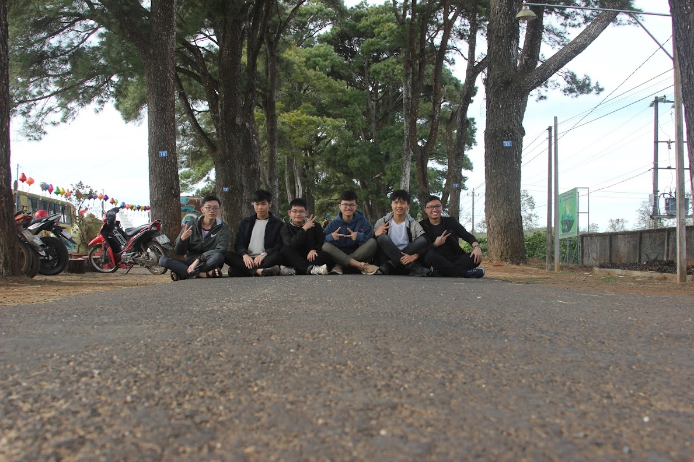

Xin chào! Mình là lelouvincx, bình thường mọi người gọi là Chính, tác giả của blog này. Bạn có thể gọi mình theo cả hai cách đều được.

Nếu gặp mình ngoài đời, bạn có thể sẽ cảm thấy thất vọng một chút. Mình không giỏi giao tiếp và duy trì mood cho cuộc trò chuyện. Đừng hiểu nhầm! Mình thích giao tiếp, chia sẻ thông tin, nhưng mình không giỏi làm nó. Vậy nên mình viết blog này để truyền đạt tri thức, tinh thần và đam mê của bản thân. Bạn có thể xem mỗi bài viết như một cuộc trò chuyện giữa bạn và mình.

Hiện tại mình là sinh viên trường Đại học Khoa học Tự nhiên HCM, ngành khoa học dữ liệu. Mình thích xây dựng và tối ưu hóa hệ thống, ứng dụng, cuộc sống, vân vân cứ cái gì có thể tối ưu được là mình thích. Vì vậy mình thường dành thời gian tìm hiểu, build, đập đi build lại x3.14 (thường xuyên tới 2, 3 giờ sáng) cho tới khi đạt được mong muốn (~~hoặc lười không làm nữa~~).

## Về blog lelouvincx

Đây là một blog về **bản thân mình**.

Bạn có thể tìm thấy ở đây kiến thức về data science, dev, productivity, tản mạn, đôi khi là review sách, nhạc, tranh, ... Bên cạnh đó là những kinh nghiệm mình học được trên con đường mình trưởng thành, những câu chuyện ý nghĩa mình gặp trong cuộc sống hằng ngày.

Phải thú thật là mình rất thích viết, nhưng đồng thời cũng rất lười. Lúc nhỏ, mình từng có một [blog](https://spiderum.com/nguoi-dung/chinhchamhoc) trên spiderum chuyên chém gió về vài vấn đề tuổi teen. Bẵng qua một thời gian, mình lên tỉnh học cấp 3 chuyên, blog đó cũng dần bị bỏ ngỏ vì lười. Bước chân lên đại học, mình cũng hùng hổ lập blog mới, đòi tự build lại từ đầu này nọ, nhưng rồi cũng bỏ dở vì lười. Rồi mình nhận ra những gì mình cần làm chỉ là viết thôi. Còn những thứ khác, để sau hãy tính (không phải lười đâu nhé =))).

## Về bản thân mình

Mình tốt nghiệp cấp 3 ở trường THPT Chuyên Hùng Vương - Gia Lai, khóa 18 - 21.

Suốt những năm cấp 3, mình điều hành một câu lạc bộ về tranh biện và tổ chức hội nghị MUN (Model United Nations) cho học sinh trong tỉnh.

Mình cũng là thành viên của đội tuyển Tin học quốc gia ở trường.

Hiện tại mình là sinh viên năm hai, khóa K21 trường đại học KHTN HCM.

## Những thứ mình làm

Chủ yếu là những thứ mình giúp ích cho cuộc sống của mình.
Bạn có thể xem thêm ở trang [project]() và [github](https://github.com/lelouvincx) của mình.

## Kết nối với mình

- [Email](mailto:dinhminhchinh3357@duck.com) (active hàng ngày)
- Trò chuyện trực tiếp với [mình](https://cal.com/lelouvincx-wjrcua)
- Nhắn tin qua [discord](lelouvincx#6976) (active thường xuyên)

## Q&A
